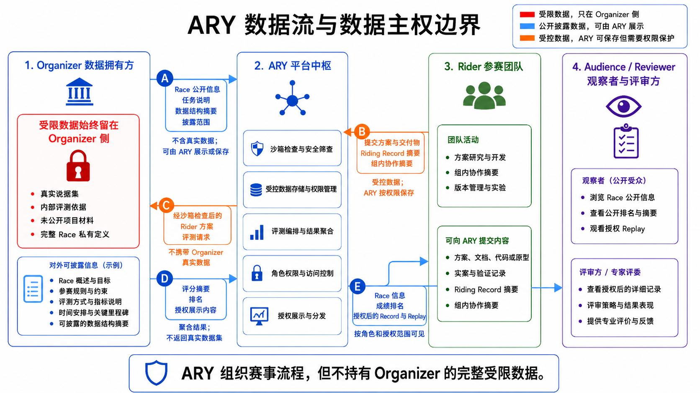

# ARY GRS 001 产品需求文档

> **飞书文档**：https://jcnboj5dg0t7.feishu.cn/docx/YJO8duPcKow8N6xg8E3cNStTn9f
> **Document ID**：YJO8duPcKow8N6xg8E3cNStTn9f
> **知识库路径**：ARY 项目知识库 / `ZRkvfoRGhlL1ggd3HOxctSB2nYf`

---

## §1 问题与动机

### 1.1 一个真实困境

假设你是某数据拥有方的负责人。你手上有一批高价值、强多样性、大规模的保密数据——这些数据涉及隐私或商业机密，绝对不能外泄，哪怕对技术服务方也不能。

但你有一个想法：**办一场比赛**。让参赛者使用 AI Agent 在这份数据上进行竞争和开发——挖掘洞察、建立模型、优化方案。你希望借助外部智慧，但又不想把数据交给任何人。

你的选项有哪些？

| 选项 | 代价 |
|------|------|
| 自建平台 | 成本极高。需要数据安全、赛事管理、评测系统——每一项都是工程深坑。 |
| 买断现有平台 | 被锁定在单一供应商。而且大多数平台要求你把数据交给它——这是不可接受的。 |
| 放弃办比赛 | 数据价值被埋没。AI 时代的外部智慧无法为你所用。 |

**这就是 ARY 存在的理由。**

### 1.2 另一个问题：代码生成门槛正在降低

传统比赛平台主要考核最终代码。代码写得好，排名就高。但在 AI 时代，这个判断开始不够完整。

Claude、Cursor、Copilot 等工具降低了代码生成门槛。代码能力仍然重要，但不再足以单独区分 Rider 的能力。真正拉开差距的，是 **Agent Riding Skill**：你怎么驾驭 Agent？你定什么目标？你怎么拆任务？你什么时候叫停、什么时候干预？你怎么验收 Agent 的产出？

**ARY 要做的，是把考核权重从最终代码移一部分给 Agent Riding Skill。**

### 1.3 核心命题

这两个问题收敛成 ARY GRS 001 要回答的核心命题：

> **Race 数据可以留在 Organizer 侧，而 ARY 仍然能够完成赛事的创建、披露、组织与展示。**

同时：

> **在 ARY 上，Rider 不只是提交代码，更重要的是展示如何骑行 Agent 完成任务。**

---

## §2 ARY 是什么

### 2.1 产品定义

ARY（Agent Riding Yard）是一个围绕**数据主权边界**设计的 Agent 赛事平台。我们让 Organizer 敢于办比赛——因为数据不必离开他的手；也让 Rider 愿意来参赛——因为这里考核的不只是代码，而是驾驭 Agent 的能力。

### 2.2 训练场 + 竞技场

| 身份 | ARY 的价值 |
|------|-----------|
| 训练场 | Rider 在这里学会骑行 Agent——定目标、拆任务、观察输出、判断正误、干预方向、验收成果 |
| 竞技场 | 各组在这里竞争——谁的 Agent Riding Skill 更好、谁的 Riding Record 更能证明骑行能力 |

### 2.3 两大差异化

| 维度 | 传统平台 | ARY |
|------|---------|-----|
| 数据主权 | 平台持有完整数据，Organizer 必须信任平台 | **Race 源数据留在 Organizer 侧，ARY 不持有完整受限数据，不缓存真实评测数据** |
| 能力标准 | 最终代码是主要评价对象 | **最终代码之外，Agent Riding Skill 也是能力证据** |

### 2.4 用户价值

| 用户 | 痛点 | ARY 提供的价值 |
|------|------|----------------|
| Organizer | 想借助外部智慧办比赛，但不能把完整受限数据交给平台或参赛者 | Race 源数据留在 Organizer 侧，ARY 只组织公开披露数据、提交转发、评分摘要和授权展示 |
| Rider | 代码生成能力被 Agent 拉平，难以只靠最终代码证明自身能力 | 用 Riding Record 展示目标设定、任务拆解、过程观察、方向干预和结果验收 |
| Audience | 难以判断一次 Agent 协作到底是人有效驾驭，还是只看到了最终结果 | 通过授权后的 Record 与 Replay 查看关键过程证据 |

### 2.5 Self-Dogfood：用 ARY 的方法建造 ARY

ARY GRS 001 是创世骑行系列赛的第一站。我们建造的正是 ARY 本身——骑着 Agent，一边建平台，一边在上面记录自己的骑行过程。**自我证明，自举建造。**

### 2.6 本次交付范围

| ✅ 本次交付 | ❌ 本次不交付 |
|------------|-------------|
| 产品需求文档（PRD） | 完整生产级系统 |
| 可运行 PoC：Public Yard / Private Race Source 最小链路 | 生产级沙箱、排队和安全审计 |
| PoC 演示 Race 创建、披露、组织、展示和数据不可用状态 | 真实受限数据接入与完整赛事运营 |
| Riding Record 摘要、Replay 关键事件和结果画像 | 默认上传完整 session 原文或完整协作历史 |

---

## §3 角色

### 3.1 架构总则

**Rider、Audience 不直接访问 Organizer 的受限数据。ARY 是赛事协作、提交转发与授权展示的中枢。**

```
              Organizer（甲方）
                 ↑↓
    Audience ← ARY → Rider

    → 表示公开信息、提交物、评分摘要和授权展示内容经由 ARY。
       真实数据和内部评测依据始终留在 Organizer 侧。
```

这个架构不是设计选择——它是数据安全的必然结果。如果 Rider 能直连 Organizer 的受限数据，完整数据就暴露了。如果 Audience 能绕过授权查看 Rider 内容，组间隔离就破了。

### 3.2 Organizer（甲方）

**完整数据的唯一主权方。**

| 职责 | 说明 |
|------|------|
| 持有完整数据 | 高价值保密数据始终在 Organizer 的机器上，任何时刻不离开 |
| 定义赛程赛制 | 填入主题、内容、比赛方式、时间线——从模板创建一个可执行的 Race |
| 控制披露范围 | 决定什么信息对 Rider 和 Audience 可见——数据结构、格式、分数级别 |
| 执行真实评测 | Rider 的方案经 ARY 转发后，在 Organizer 侧用真实数据运行，返回评分 |
| 查看赛事全景 | 通过 ARY 面板查看各组进度、Riding Record、排名 |

### 3.3 ARY（我方）

**数据安全保障下的中枢平台。**

| 职责 | 说明 |
|------|------|
| 提供赛事模板与创建工具 | Organizer 通过模板定义 Race |
| 连通三方 | 公开信息、提交物、评分摘要和授权展示内容经由 ARY 路由——Organizer 不绕过 ARY 直连 Rider |
| 提交评测编排 | 本次 PoC 组织 Rider 提交并触发 Organizer 侧评测；正式系统中可加入假数据沙箱、基础执行检查和排队机制 |
| 管理组内协作 | 同组 Rider 间提供 GitHub 式托管：Record 摘要、关键事件、授权片段、回放和互评协作。完整协作原文默认留在 Rider 本地 |
| 管理组间隔离 | 不同组之间方案和 Riding Record 投影严格隔离。仅公示分数和排名 |
| 按授权向 Audience 展示 | 仅展示 Organizer 允许披露的数据 |

**关键的"不做"：**
- 不碰完整私有数据
- 不缓存 Organizer 的真实数据集
- 不做超越 Organizer 授权的披露
- 不控制 Organizer 的服务

### 3.4 Rider（骑手）

**生产者。不是来答题的，是来建东西的。**

| 职责 | 说明 |
|------|------|
| 接收项目需求 | 仅此而已。Rider 手头没有完整私有数据 |
| 驾驭 Agent 产出方案 | 目标设定 → 任务拆解 → Agent 协同 → 过程观察 → 方向干预 → 验收 |
| 组内协作 | 互查 Riding Record、互评、留言板提问（Agent 可代劳） |
| 提交方案 | 在本次 PoC 中触发 Organizer 侧评测；正式系统中可接入沙箱验证和排队转发 |
| 查看成绩和排名 | 仅见本组评分和排行榜位置——看不到其他组的方案和 Record 投影 |

### 3.5 Audience（观众）

**经授权的观察者。**本文将评审方、观看者和被授权观察者统一归为 Audience，可能是外部评审、投资方、学习者或其他 Organizer。本文中的 Rider 对应评审标准中的 Participant，只是 ARY 产品语境下称为 Rider。

| 职责 | 说明 |
|------|------|
| 查看经授权的可视化数据 | 赛事概况、公开 Record、排行榜——范围完全由 Organizer 决定 |
| 不接触原始数据 | Audience 看到的一切都经过 Organizer 授权和 ARY 过滤 |

---

## §4 用例

`UC-{角色缩写}{序号}` 标注。每条用例标注涉及的角色、关键数据流、安全边界。

### 4.1 Organizer 用例（UC-O*）

| 编号 | 用例 | ARY 暴露什么 | 是否触及受限数据 |
|------|------|-------------|----------------|
| UC-O1 | 从模板创建 Race | 模板表单：主题、内容、方式、时间 | 否——元数据，不涉及原始数据 |
| UC-O2 | 定义披露范围 | 权限配置界面 | 否——只是权限定义 |
| UC-O3 | 向 ARY 告知数据结构与格式 | 数据结构描述 | 否——只是 schema，不含数据实体 |
| UC-O4 | 接收经 ARY 转发的方案并评测 | Rider 方案（代码/文档） | 否——方案是 Rider 的产出，不是原始数据 |
| UC-O5 | 返回评分 | 分数 + 排名 | 否——聚合指标 |
| UC-O6 | 设定展示范围（对 Audience） | 可视化的开关和粒度 | 否 |
| UC-O7 | 撤销授权 | 授权状态变更 | 否——但影响全局（参见 §6 安全机制） |

### 4.2 Rider 用例（UC-R*）

| 编号 | 用例 | 产生 Riding Record | 备注 |
|------|------|-------------------|------|
| UC-R1 | 理解项目需求 | ✅ 目标设定记录 | 仅有需求文档 |
| UC-R2 | 制定组内分工与骑行计划 | ✅ 计划记录 | ARY 面板直观分工 |
| UC-R3 | 驾驭 Agent 产出方案 | ✅ 过程证据 | 核心用例，见下方展开 |
| UC-R4 | 观察 Agent 产出并判断 | ✅ 观察与判断 | 识别错误、遗漏、幻觉 |
| UC-R5 | 干预 Agent、修正方向 | ✅ 干预记录 | 方向调整、重构决策 |
| UC-R6 | 验收 Agent 工作成果 | ✅ 验收记录 | 组内互审 |
| UC-R7 | 组内互查 Riding Record | ✅ 互评记录 | Agent 可代劳评论 |
| UC-R8 | 留言板提问 | ✅ 沟通记录 | Agent 可代劳 |
| UC-R9 | 提交方案 | — | 提交后触发 Organizer 侧评测；正式系统可接入沙箱和队列 |
| UC-R10 | 查看成绩与排名 | — | 组间仅见排行，方案隔离 |

### 4.3 关键用例展开

#### UC-R3 驾驭 Agent 产出方案

Rider 手头只有项目需求。方案从无到有，全靠驾驭 Agent。

1. 根据 Riding Plan 拆解任务，向 Agent 下达 Prompt
2. Agent 产出——可能是方案、代码、图表，也可能是幻觉和废话
3. Rider 阅读 → 标注疑点 → 决定接受、修改或抛弃
4. Rider 整理过程证据，形成可审阅的 Riding Record 摘要

**Agent Riding Skill 的产品化证据结构**：

| 证据 | ARY 需要承接什么 | 评审判断什么 |
|------|----------------|--------------|
| Plan | 目标、约束、任务拆解、分工计划 | Rider 是否能把复杂任务拆成可执行步骤 |
| Observation | Agent 输出摘要、疑点、遗漏、幻觉或偏差 | Rider 是否能观察并判断 Agent 产出 |
| Steering | 中途干预、方向修正、重构决策 | Rider 是否能把 Agent 拉回正确方向 |
| Validation | 验证动作、验收结果、失败修正 | Rider 是否能证明产出可用，而不是只接受生成结果 |
| Reflection | 复盘、边界说明、下一轮改进 | Rider 是否形成计划、观察、干预、验收、复盘的闭环 |

**数据边界**：Rider 基于项目需求描述问题——不持有真数据也不需要真数据。完整协作原文默认留在 Rider 本地，ARY 接收的是 Rider 选择后的摘要、关键事件和授权展示片段。

#### UC-O4 + UC-R9 提交评测链

这是 ARY 最核心的一条交互链路，串起了三个角色：

```text
Rider → ARY
       → 提交方案并触发评测流程
       → Organizer 侧使用真实数据评测
       → 返回评分摘要
       → ARY 展示本组成绩与公开排名（组间仅此可见）
```

**正式系统目标链路**：在生产形态中，ARY 还应在转发前加入假数据沙箱、基础执行检查和排队机制，用来保护 Organizer 侧安全并控制并发压力。

**安全含义**：
- ARY 不接触真实数据，只组织提交、状态和结果摘要
- 组织者侧的真实数据和内部评测依据始终留在 Organizer 侧
- 评分返回的是分数、等级或公开评语——不是原始数据、不是中间结果、不是评测细节

---

## §5 功能需求

`FR-O*` 服务于 Organizer，`FR-R*` 服务于 Rider。

### 5.1 Organizer 侧

| 编号 | 功能需求 | 对应用例 |
|------|---------|---------|
| FR-O1 | Race 模板创建工具：填写主题、内容、方式、时间，生成一个可执行的 Race 项目 | UC-O1 |
| FR-O2 | 披露范围配置：定义数据结构格式、内容类型，控制向 Rider/Audience 的露出程度 | UC-O2, O3, O6 |
| FR-O3 | 中转评测面板：接收 ARY 转发来的 Rider 方案、查看队列状态、返回评分 | UC-O4, O5 |
| FR-O4 | 授权管理：随时调整权限范围、撤销授权、设置时效 | UC-O6, O7 |
| FR-O5 | 赛事全景面板：各组进度、Riding Record、排名一览 | — |

### 5.2 Rider 侧

| 编号 | 功能需求 | 对应用例 |
|------|---------|---------|
| FR-R1 | Race 需求展示：清晰呈现项目需求、赛制、时间线 | UC-R1 |
| FR-R2 | Agent 协作入口：帮助 Rider 组织目标、约束、任务拆解和验收标准 | UC-R3~R6 |
| FR-R3 | Riding Record 摘要与回放：管理 Rider 选择后的 Plan、Observation、Steering、Validation、Reflection 关键事件 | UC-R3~R6 |
| FR-R4 | 骑行过程整理：把工作内容摘要、Rider 判断和验证结果汇聚为组内贡献面板，提高事后伪造成本 | UC-R3~R6 |
| FR-R5 | 组内协作空间：互查 Record 摘要、互评、留言板（Agent 可代劳） | UC-R7, R8 |
| FR-R6 | 提交评测：提交方案并触发 Organizer 侧评测；正式系统中可加入沙箱和队列 | UC-R9 |
| FR-R7 | 排名看板：本组评分 + 排行榜位置。其他组方案和 Record 投影不可见 | UC-R10 |

### 5.3 功能需求与四个核心动词的对应

| 动词 | 对应 FR |
|------|--------|
| **创建** | FR-O1（模板创建 Race） |
| **披露** | FR-O2（披露范围配置）、FR-O4（授权管理）、FR-R7（排名选择性披露） |
| **组织** | FR-O3（中转评测）、FR-R2~R6（骑行协作全链路） |
| **展示** | FR-O5（赛事全景面板）、FR-R7（排名看板） |

---

## §6 数据安全机制

**这是 ARY 存在的前提。** 没有这个前提，Organizer 不会选择 ARY——他会自建、买断、或者干脆不办比赛。

### 6.1 数据主权三级分类

| 级别 | 内容 | 所在位置 | ARY 是否持有 |
|------|------|---------|-------------|
| **受限数据** | 完整 Race 私有定义、真实数据集、内部评审依据、未公开项目材料 | Organizer 侧 | ❌ 从不持有 |
| **Rider 本地素材** | 完整 session 原文、完整协作历史、未选择公开的过程材料 | Rider 或队伍本地 | ❌ 默认不持有 |
| **公开披露数据** | 赛事基本信息、Organizer 授权摘要、Riding Record 摘要、Replay 关键事件、评分、排名 | ARY 展示层 | ✅ 仅经授权的部分 |
| **受控数据** | 参赛者提交、队伍资料、阶段性成果、授权展示片段 | ARY 受控存储 | ⚠️ 持有但受权限保护、组间隔离 |

### 6.2 数据流与数据主权边界图

下图展示 ARY 在 Race 流程中的数据流向。红色受限数据始终留在 Organizer 侧；蓝色公开披露数据可以由 ARY 展示；橙色受控数据可以由 ARY 保存，但必须受到角色权限和授权范围保护。完整 Riding session 原文默认留在 Rider 或队伍本地，ARY 只接收被选择和授权后的摘要、关键事件或公开投影。



### 6.3 权限矩阵

| 数据 | Organizer | 本组 Rider | 其他组 Rider | Audience |
|------|-----------|------------|--------------|----------|
| Race 公开信息 | 可见 / 可配置 | 可见 | 可见 | 按授权可见 |
| 公开评分与排名 | 可见 / 可配置 | 可见 | 可见 | 按授权可见 |
| 本组提交 | 可见 | 可见 | 不可见 | 按授权可见 |
| 本组 Riding Record 摘要 | 可见 | 可见 | 不可见 | 按授权可见 |
| 其他组提交与 Record | 可见 | 不可见 | 仅本组可见 | 按授权可见 |
| Organizer 真实数据集 | 可见 | 不可见 | 不可见 | 不可见 |
| Organizer 内部评测依据 | 可见 | 不可见 | 不可见 | 不可见 |

### 6.4 六项安全机制

#### 1. 数据可用性实验

核心证明手段。本次 PoC 通过 Organizer 评测可用性切换证明 ARY 没有缓存真实数据：

| 阶段 | 操作 | 页面结果 | 证明什么 |
|------|------|---------|---------|
| 1 | Organizer 披露 Race，ARY 展示 `/yard` 和 `/race/grs-001` | 只能看到公开摘要 | ARY 展示来自 Organizer 授权披露 |
| 2 | 关闭 Organizer 评测可用性后提交 | 显示“数据缺失，暂无法评分” | 平台无法脱离 Organizer 独立评测 |
| 3 | 重新开启评测可用性后提交 | 显示本队结果、Record 摘要和结果画像 | 平台只组织提交与评分摘要 |
| 4 | 查看 `/leaderboard` | 只展示公开排名、等级和公开评语 | 组间方案和完整 Record 不公开 |

#### 2. 正式系统中的沙箱假数据验证

在生产形态中，Rider 方案转发给 Organizer 之前，应先在 ARY 的假数据环境中做基础执行检查，例如明显死循环、异常退出和不符合提交格式的问题。这个机制用于降低 Organizer 侧接收盲盒方案的风险，不等同于完整安全审计。

#### 3. 组间隔离

方案和 Riding Record 是各组隐私资产。不同组之间只能看到分数和排名——抄袭风险通过权限隔离被降低。

#### 4. 骑行记录可信度

ARY 可以接收 Rider 选择后的过程摘要、关键事件和验证节点，并用时间线、人工确认和交叉验收提高事后伪造成本。这不能保证杜绝伪造，也不要求平台默认保存完整协作原文。

#### 5. Agent 代劳可追溯

Agent 可以代发评论、代提问——但 Riding Record 摘要必须标注哪些内容来自 Agent 产出，哪些内容来自 Rider 判断、干预和验收。

#### 6. 展示边界

ARY 页面只呈现用户可理解的状态——不出现内部路径、文件名、版本指纹、JSON 快照、服务请求细节、终端操作提示。Organizer 的私有数据和评测内部逻辑不会泄露给任何页面。

### 6.5 安全机制的"反证法"

每一个安全机制都在回答同一个质疑：**"我怎么知道你没有偷偷保存我的数据？"**

| 质疑 | 回答 |
|------|------|
| 你是不是缓存了我的数据做评测？ | 数据可用性实验：数据不可用时你看到的是缺失 |
| 你转发的代码会不会攻击我的服务器？ | 正式系统目标：先做假数据环境基础执行检查，再受控转发 |
| 你不知道会不会把我的方案泄漏给对手？ | 组间隔离：方案和 Record 投影不可见，只有分数 |
| 你怎么保证 Rider 没伪造骑行记录？ | 过程摘要、关键事件、验证节点和人工确认提高伪造成本 |
| Agent 干的事和人干的怎么分？ | 日志区分 Agent 和人，可追溯 |

---

## §7 关键技术 PoC

### 7.1 PoC 目标

用可运行 PoC 证明 Public Yard / Private Race Source 主链路：Race 源数据留在 Organizer 侧，ARY 只展示公开披露、组织提交状态和公开结果。

### 7.2 页面路径与证明点

| 页面 | 路由 | 评审看到什么 |
|------|------|-------------|
| Public Yard | `/yard` | ARY 当前可见的公开 Race，只展示 Organizer 披露内容 |
| Race 公开页 | `/race/grs-001` | Race 公开摘要、参与入口和披露状态 |
| Organizer 面板 | `/organizer`、`/organizer/race` | Organizer 侧 Race 创建、披露和评测可用性控制 |
| Team 提交 | `/team/submit` | Rider 提交方案并触发 Organizer 侧评测；数据不可用时不能评分 |
| Team Records | `/team/records`、`/team/replay` | 本队整理后的 Plan、Observation、Steering、Validation、Reflection 和回放事件 |
| 公开榜单 | `/leaderboard` | 只展示公开排名、等级、公开评语和结果画像 |

### 7.3 实验性证明流程

评审可以按固定路径操作：

1. 打开 `/yard` → 查看 ARY 当前可见的公开 Race
2. 打开 `/race/grs-001` → 查看 Organizer 主动披露的公开摘要
3. 使用 Organizer 账号进入 `/organizer` 或 `/organizer/race` → 查看 Race 源数据状态、创建披露状态和评测可用性
4. 关闭评测可用性后，用 `team_001` 进入 `/team/submit` 提交 → 页面显示“数据缺失，暂无法评分”
5. 重新开启评测可用性后再次提交 → 进入 `/team/records` 查看本队整理后的 Riding Record 摘要、回放节点和结果画像
6. 打开 `/leaderboard` → 只看到公开排名、等级、公开评语和公开结果画像

该流程证明：ARY 能组织 Race 的发现、披露、提交和展示，但不能脱离 Organizer 侧数据生成评分。

### 7.4 验证方式

在提交仓库中运行：

```bash
cd PoC-GRS-001
npm run verify
```

当前本地 PoC 验证通过：

```text
VERIFY_PASS GRS001 creation disclosure lifecycle riding evidence result radar holds
```

---

## §8 验收标准

| # | 评估维度 | 验收项（摘要） | 验收方法 |
|---|---------|-------------|---------|
| 1 | 问题定义是否被真正理解 | 明确 PoC 不是普通赛事系统，而是验证「ARY 不持久化完整 Race 数据也能完成赛事最小链路」；明确排除范围；明确 self-dogfood 理念 | 检查产品定义，确认未偏离核心 |
| 2 | 产品逻辑是否成立 | 以最小链路覆盖创建→披露→组织→展示；所有流程追溯到「数据在 Organizer 侧」；无逻辑矛盾 | 走查完整流程；模拟异常场景 |
| 3 | 去中心化数据主权是否清楚 | Race 受限数据归 Organizer；ARY 不拥有也不控制 Organizer 的受限数据；展示仅来自主动披露或授权投影 | 检查系统设计；走查授权展示边界 |
| 4 | PoC 是否证明关键假设 | Public Yard / Private Race Source 主链路可观察验证；数据不可用时不能评分；恢复可用后只展示评分摘要和公开结果 | 手动走查 `/yard`、`/race/grs-001`、`/organizer`、`/team/submit`、`/team/records`、`/leaderboard` + `npm run verify` |
| 5 | 架构边界是否清晰 | 三角色职责无交叉；ARY 只做公开披露展示、提交编排和结果展示；数据流向清晰 | 检查架构图；走查页面行为 |
| 6 | 展示是否清晰 | 完整展示路径；状态用业务语言表达；不暴露内部实现 | 手动走查；检查源码和网络请求 |
| 7 | Agent Riding Skill 是否可评价 | Riding Record 覆盖 Plan、Observation、Steering、Validation、Reflection；能区分 Agent 产出和 Rider 判断；能看出中途干预、修正和验收过程 | 查看 Record 摘要、回放关键事件、验证节点和人-Agent 分工 |

*完整验收标准详见知识库 sheet《验收标准》(N0nHsFRPqhM4mHtqgONcDUSJnMh)*

---

## §9 风险与应对

| # | 风险 | 影响 | 等级 | 应对 |
|---|------|------|------|------|
| 1 | 代码存在未发现 Bug | 演示崩溃或数据错误 | 🟡 中 | 开发测试并行；至少 3 次全流程预演 |
| 2 | 文档逻辑混乱 | 无法传达方案和协同过程 | 🟡 中 | 统一模板；专人审核；交叉审核 |
| 3 | 核心假设证明力不足 | 无法让评审信服 | 🔴 高 | 通过状态切换、验证脚本和手动走查证明平台不复用 Organizer 受限数据 |
| 4 | 偏离「智能体骑行」核心 | 被当成传统软件开发或普通 OJ | 🔴 高 | 将 Riding Record 设计为 Plan、Observation、Steering、Validation、Reflection 的过程证据，而不只展示最终提交物 |
| 5 | 做了过多非核心功能 | 重心偏离 | 🟡 中 | 严格按优先级排列；优先实现数据主权相关功能 |

*完整风险分析详见知识库 sheet《风险分析》(LpOCsocDLhDlOetg2TxcpSUFnnf)*

---

## §10 边界与后续演进

### 10.1 GRS 001 的边界

| ✅ 本次做什么 | ❌ 本次不做什么 | 为什么不在本次 |
|-------------|--------------|-------------|
| 产品定义 | 完整赛事运营 | 由后续子系统实现 |
| PoC 证明核心假设 | 指导骑行 | 由后续课程和 coach 支持 |
| Race 创建、披露、组织、展示的最小链路 | 真实受限数据接入 | 本次只验证数据主权边界和平台组织方式 |
| Organizer 评测可用性切换 | 完整生产级沙箱、排队和安全审计 | PoC 阶段用本地服务证明边界，不包装成生产能力 |
| Riding Record 摘要、Replay 关键事件和结果画像 | 默认集中保存完整 session 原文 | 完整历史默认留在 Rider 或队伍本地 |

### 10.2 PoC 简化实现与替换方向

当前 PoC 使用本地轻量实现来验证核心假设，不代表最终系统形态：

| 简化对象 | 当前做法 | 后续替换方向 |
|----------|---------|-------------|
| Race 源数据 | 放在 Organizer 侧本地目录和本地服务中 | Organizer 自有数据环境、授权接口和部署地址 |
| 公开披露数据 | ARY 读取公开摘要、Race 索引和公开榜单内容 | 正式披露配置、权限策略和审计记录 |
| 评测可用性 | 通过 Organizer 评测服务状态切换证明数据边界 | 真实评测任务、异步状态、结果摘要和失败原因分级 |
| 参赛者提交 | 文本摘要触发评测流程 | 正式提交表单、文件上传、队伍权限和队列 |
| Riding Record | 保存整理后的摘要、关键事件、Replay 节点和结果画像 | 正式系统保存审核后的摘要、授权片段和公开投影；完整 session 原文默认留在 Rider 本地 |
| 用户身份 | 本地账号区分 Organizer 和队伍 | 正式登录、角色、队伍和权限系统 |
| 页面形态 | 轻量本地页面和静态视觉素材 | 正式 UI、组件化页面和部署流程 |

### 10.3 后续演进原则

- **数据主权不变**：无论系统如何升级，Organizer 始终控制受限数据，ARY 只展示公开披露数据、授权摘要和公开投影
- **Agent Riding Skill 权重不降**：Riding Record 的价值只会增长——评分的核心依据
- **中枢架构不改**：Rider 和 Audience 不直接访问 Organizer 受限数据，公开信息、提交物、评分摘要和授权展示内容经由 ARY 协调
- **self-dogfood 不止**：本场 GRS 001 的 Riding Record 就是下一场 GRS 002 的素材
