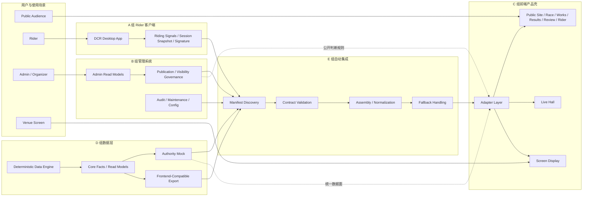
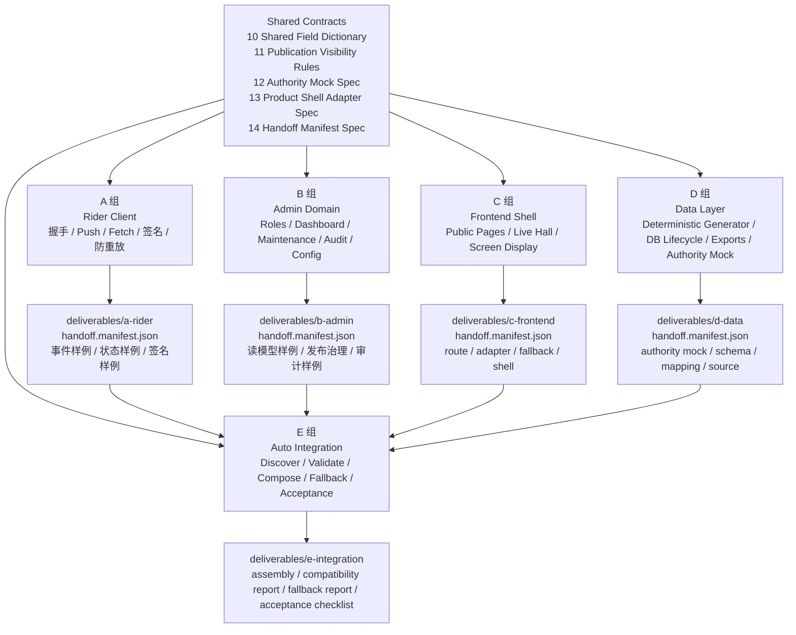
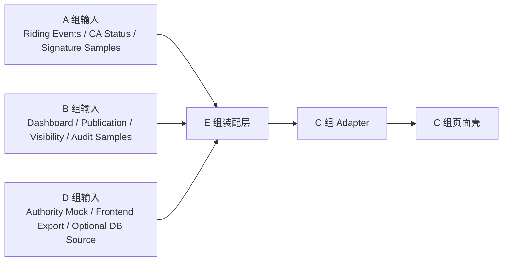
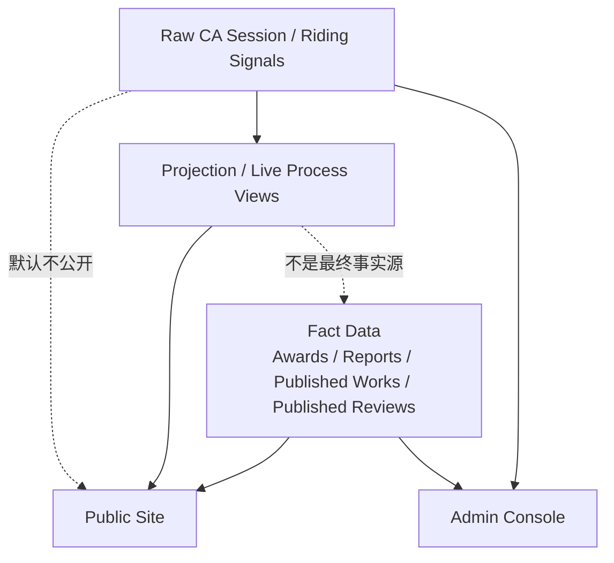
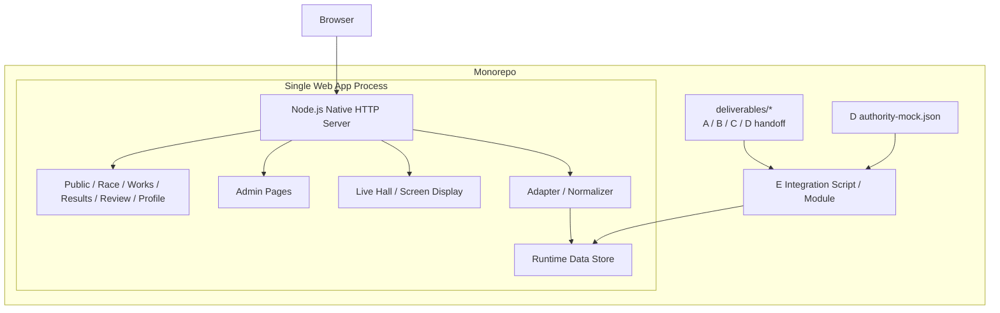

# ARY 架构图与组件图

本文给 A、B、C、D、E 五组一个统一的系统视图。用途不是替代任务文档，而是帮助所有人快速确认：

1. 自己所在的组件位置。
2. 数据和责任如何流动。
3. 为什么要用 shared contract、handoff manifest、authority mock 和 adapter。

## 1. 总体逻辑架构图

## 2. 组件职责图

## 3. 运行时读取关系图

这个图表达三个硬约束：

1. 页面层不直接读 A、B 的原始样例。
2. E 不直接改页面结构，只提供装配后的输入。
3. D 的 authority mock 是第一轮主数据面，但仍允许 E 注入 A、B 的 handoff 做统一验证和补齐。

## 4. 公开规则与事实边界

解释：

1. 原始 CA Session 默认不进公开端。
2. Projection 只服务过程展示，如 Live Hall / Screen Display。
3. Results / Review / Published Work / Public Profile 这类公开资产，必须以事实数据和发布态规则为准。

## 5. 组件落地建议

1. A、B、D 的交付要优先保证 manifest 完整和样例可消费，否则 E 无法自动发现。
2. C 的页面壳要优先围绕 adapter 边界收口，不要再让页面直接读散落 JSON。
3. E 的组装逻辑要以 contract 校验为第一步，不能先拼页面再补规范。
4. 如果需要一张给组员开会时快速讲解的图，优先使用本文第 2 节组件职责图。

## 6. 单机 Monorepo 部署图

这个部署图强调的是：

1. 逻辑上仍然有 A、B、C、D、E 分工。
2. 但运行和部署上尽量收口到一个 monorepo、一个进程、一个 Web 应用。
3. 自动集成更适合作为仓库内脚本或同进程模块，而不是额外服务。